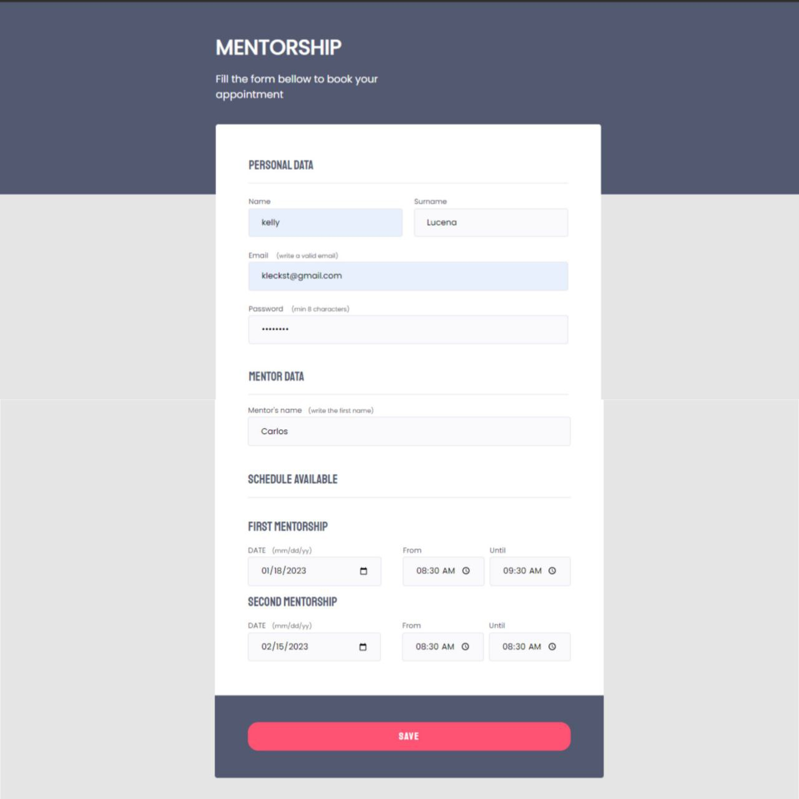

# Mentorship
> Explorer Challenge - Stage 03:

Project created in the Explorer Program promoved by Rocketseat.

🔗 [check here](https://kleck-lucena.github.io/Mentorship/)

## ⚒️ Tech Applied:
- HTML
- CSS

## 👩‍💻 Experience:
Project created with form fundamentals for example: fields and inputs.   Applications that was applied: text, date, time, password, email, validation and submit. 
